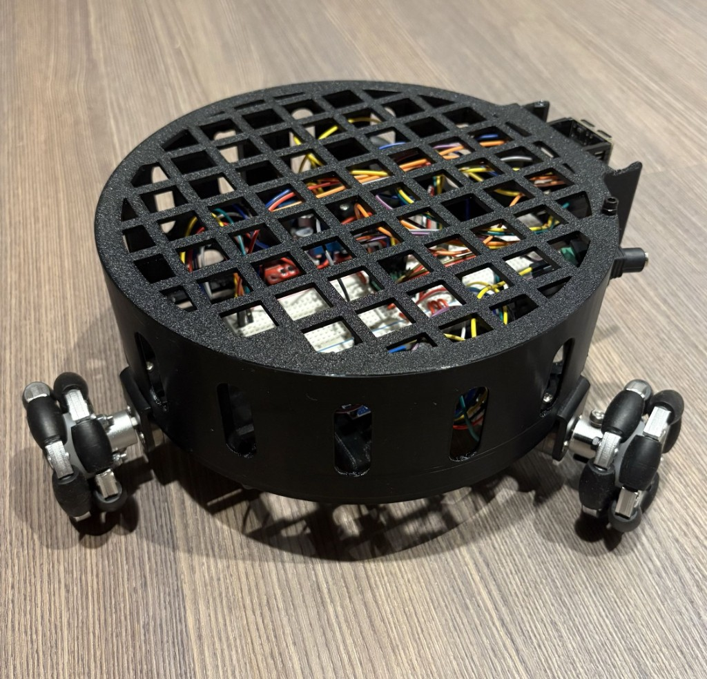

# Omni Rover

Three omni wheels, ESP32-S3, phone web controller.

Firmware: [`three_motor_test`](three_motor_test). Copy `secrets.example.h` to `secrets.h`, flash with PSRAM **disabled**, then open `http://omnirover.local` or the IP printed on serial.
